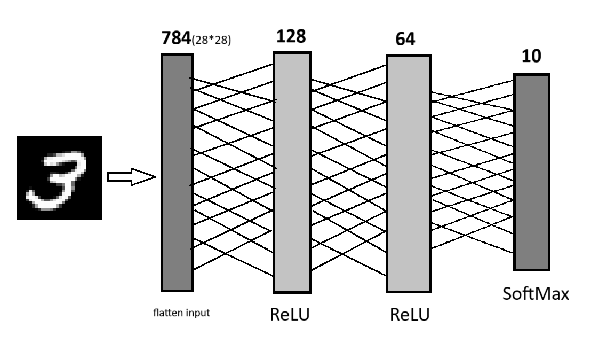
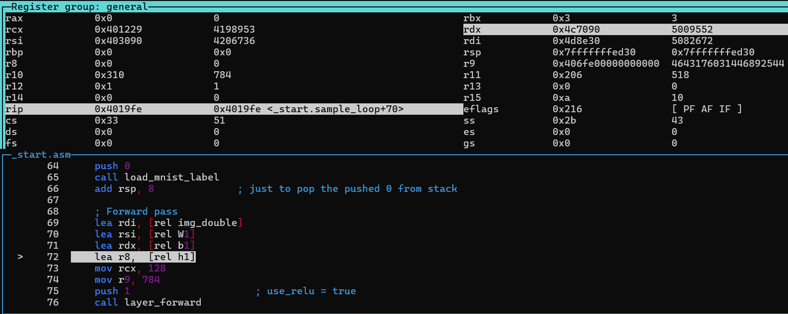
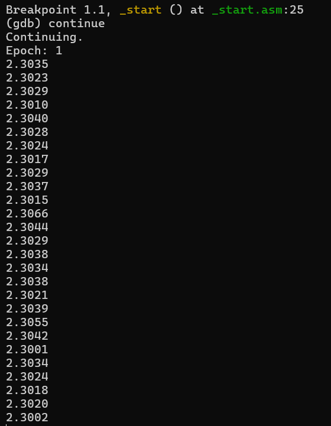
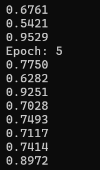
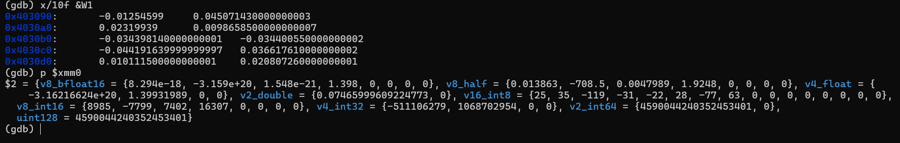

# Neural Network in Assembly — MNIST from Scratch

**Author:** Me and Copilot

## Overview
This project implements a simple neural network entirely in **x86 assembly language** to recognize handwritten digits from the **MNIST dataset**. The goal was to understand how neural networks work at the lowest level — from memory layout and arithmetic operations to training logic — without relying on high-level libraries or frameworks. It runs in a lightweight **Debian Slim** environment via Docker for easy setup.


## Why I Built This
Sometimes, ***we think we truly understand something, until we try to build it from scratch.***
When ***theory meets practice, every small detail becomes a challenge***.

I decided to write this project in pure assembly language to push my limits and see what really happens behind high-level neural network frameworks. It was a deep dive into how each operation — from matrix multiplication to gradient updates — actually works at the CPU level.

Throughout this project, I faced many challenges in both implementation and understanding of neural network concepts. But this is just the beginning — I plan to continue building what I want to know from scratch in deep learning and neural networks, creating everything in assembly to truly understand how they work underneath.



## How It Works

### Network Architecture

| Layer       | Size | Activation |
|------------|------|------------|
| Input      | 784  | – (flattened MNIST image) |
| Hidden 1   | 128  | ReLU |
| Hidden 2   | 64   | ReLU |
| Output     | 10   | Softmax |

### Training Details

- **Epochs:** 10  
- **Batch size:** 64  
- **Training samples:** 60,000  
- **Test samples:** 10,000  
- **Learning rate:** 0.01  


##  Challenges
+ I first wanted to make this for Windows, but Windows API calls in assembly were too complicated to debug. So I switched to Linux where I could use GDB in the terminal, which was hard but fun to learn

+ For the softmax and loss functions, I needed exp() and log(). Instead of writing them myself, I used the math library by linking with -lc -lm.

+ To help debug, I wrote the same neural network in Python to compare outputs and find where my assembly was wrong.

+ I tried to make my functions flexible and reusable across different parts of the neural network.

+ I tried to minimize using the stack and use registers more instead. It was really hard to find registers that weren't already being used somewhere else.

## Code
The program starts from `_start.asm` and trains the neural network on MNIST data. In 10 epochs It processes images in batches, passing them through three layers (128 → 64 → 10 neurons) with ReLU activation. For each batch, it calculates the loss and uses backpropagation `backprop.asm` to compute gradients for all weights and biases in (dW1, dbias1, ...).

After each batch, `gradient.asm` updates the weights using these gradients and a learning rate of 0.01. `layers_buffer.asm` provides the memory space for all layer outputs and gradients. Once training completes, the program tests the network on unseen images and prints the final accuracy.

The `build.sh` script assembles all NASM files into object files, links them with the math libraries, and produces the final executable.


## Build & Run with Docker
This project can be built and run inside a Docker container with NASM and build tools installed. Follow these steps:

#### Build the Docker image
```bash
docker build -t nasm-assembly .
```

### Run the Docker Container
```
docker run \
  --volume="PATH/TO/PROJECT:/mnt/project" \
  --cpus=4 \
  --memory=4g \
  --memory-swap=4g \
  nasm-assembly
```
Replace `PATH/TO/PROJECT` with your local project folder, e.g.:

- Windows: `C:/Users/YourName/NASM_MNIST`  
- Linux/Mac: `/home/username/NASM_MNIST`

#### Enter the Container
```
docker exec -it <container_id_or_name> bash
```

#### Run & build 
This project includes a `build.sh` script to assemble, link, and run the NASM MNIST neural network.

```
./build.sh
```
- This will assemble all .asm files, link them, and produce the executable ./mnist.

Run the neural network:
```
./mnist
```

### Debugging Environment


### Starting


### Converging


### Checking values


### Accuracy 86%

